# 🔄 Fluxos do Sistema - MultBot

## Sumário

1. [Fluxo de Autenticação](#1-fluxo-de-autenticação)
2. [Fluxo de Criação de Bot](#2-fluxo-de-criação-de-bot)
3. [Fluxo de Pagamento (Cliente Final)](#3-fluxo-de-pagamento-cliente-final)
4. [Fluxo de Transação (Sistema)](#4-fluxo-de-transação-sistema)
5. [Fluxo de Configurações](#5-fluxo-de-configurações)
6. [Fluxo de Dashboard](#6-fluxo-de-dashboard)
7. [Fluxo de Gerenciamento de Bots](#7-fluxo-de-gerenciamento-de-bots)

---

## 1. Fluxo de Autenticação

### 1.1 Login do Administrador

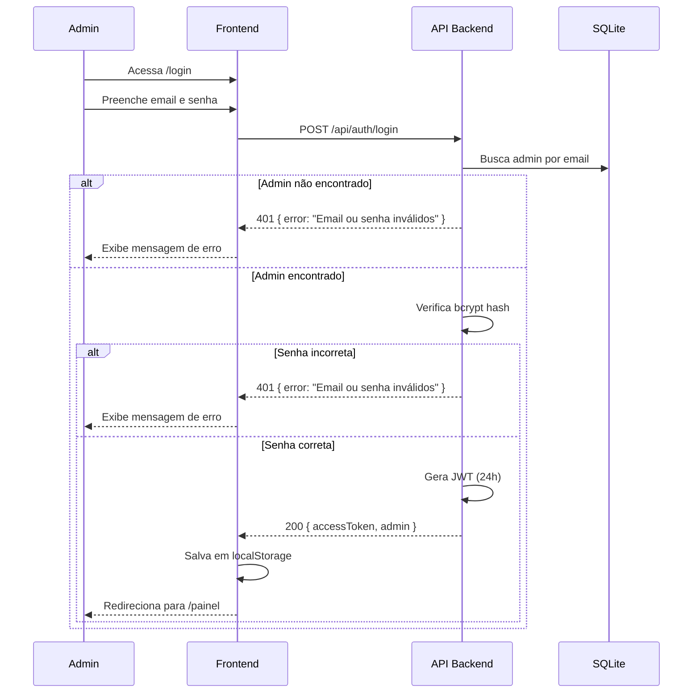

### 1.2 Verificação de Token (Rotas Protegidas)

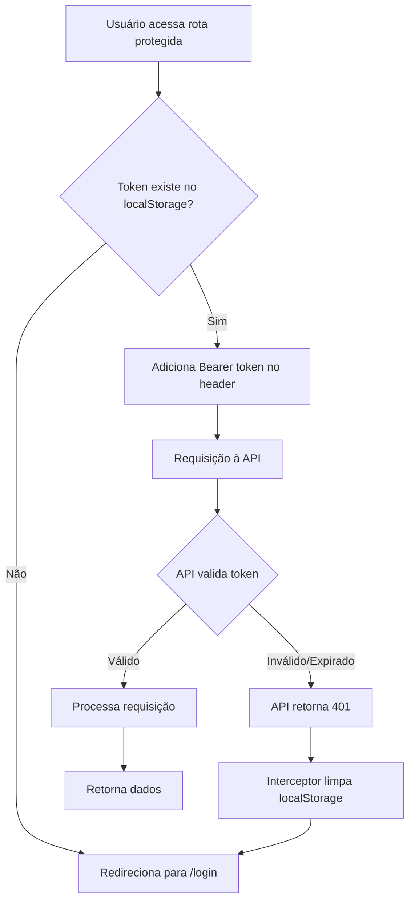

### 1.3 Logout

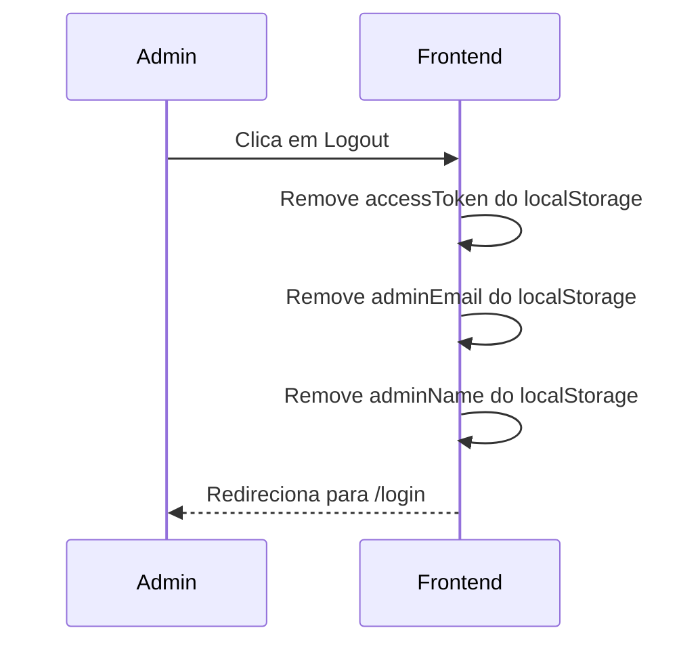

---

## 2. Fluxo de Criação de Bot

### 2.1 Criar Novo Bot Telegram

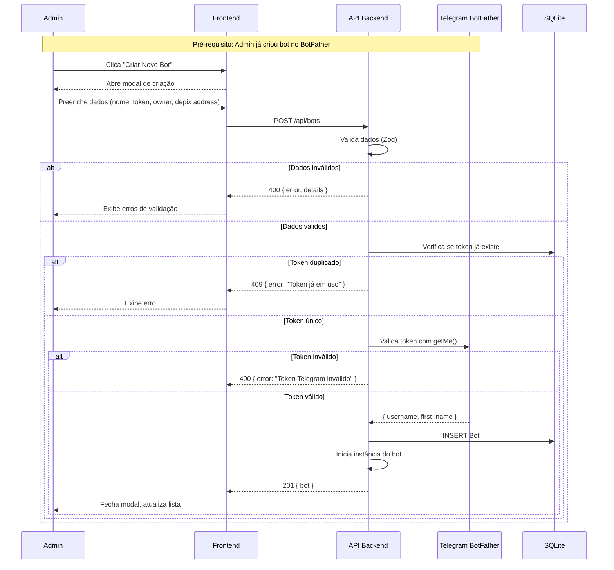

### 2.2 Dados Necessários

| Campo | Obrigatório | Validação |
|-------|-------------|-----------|
| name | Sim | 3-100 caracteres |
| telegramToken | Sim | Formato válido Telegram |
| ownerName | Sim | 3-100 caracteres |
| depixAddress | Sim | Endereço Liquid válido |
| splitRate | Não | 0-1 (padrão: 0.10) |

---

## 3. Fluxo de Pagamento (Cliente Final)

### 3.1 Pagamento via Bot Telegram

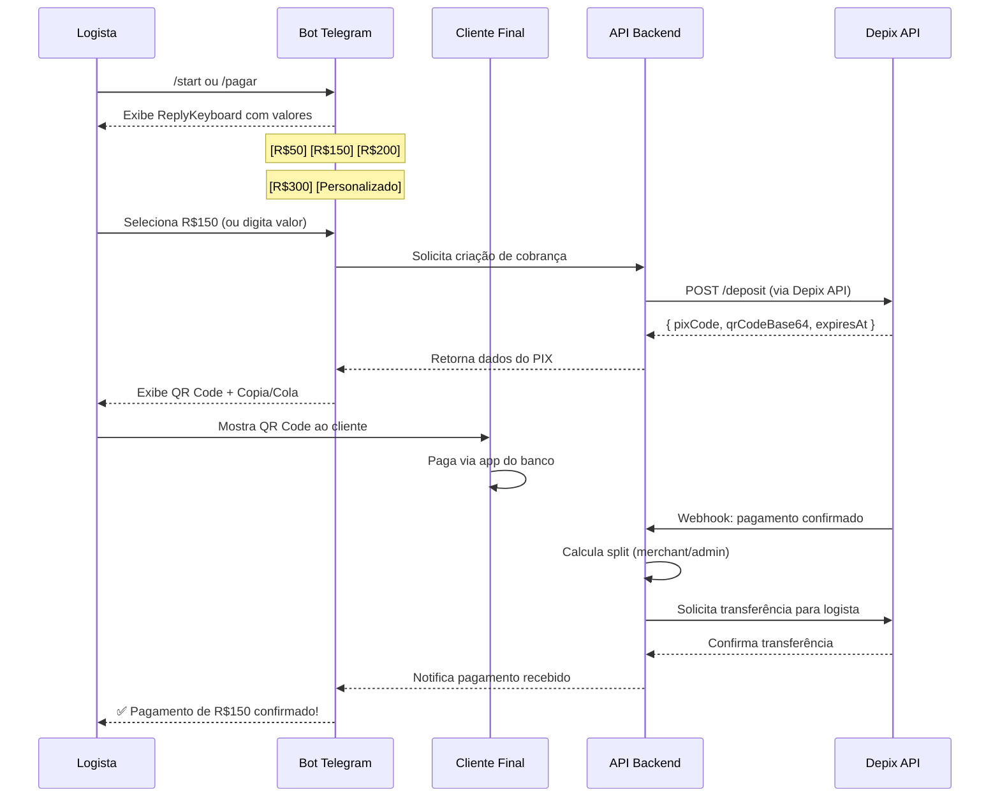

### 3.2 Reply Keyboard do Bot

```
┌─────────────────────────────────────┐
│ 💰 Selecione o valor da venda:      │
├───────────┬───────────┬─────────────┤
│   R$ 50   │  R$ 150   │   R$ 200    │
├───────────┼───────────┼─────────────┤
│  R$ 300   │  R$ 500   │   R$ 1000   │
├───────────┴───────────┴─────────────┤
│        ✏️ Valor Personalizado        │
└─────────────────────────────────────┘
```

---

## 4. Fluxo de Transação (Sistema)

### 4.1 Ciclo de Vida da Transação

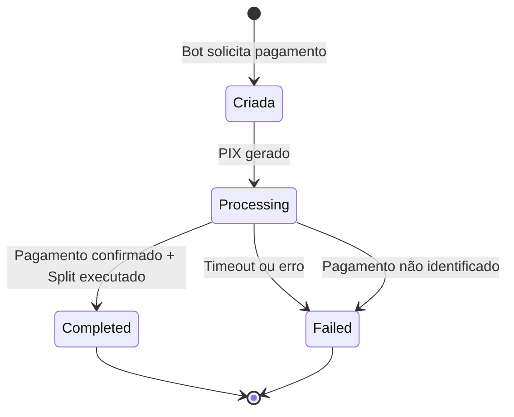

### 4.2 Estados e Ações

| Estado | Descrição | Ações Possíveis |
|--------|-----------|-----------------|
| `processing` | PIX gerado, aguardando pagamento | Cancelar, Ver QR Code |
| `completed` | Pagamento confirmado e split executado | Ver detalhes |
| `failed` | Erro ou timeout | Retentar, Ver motivo |

### 4.3 Cálculo do Split

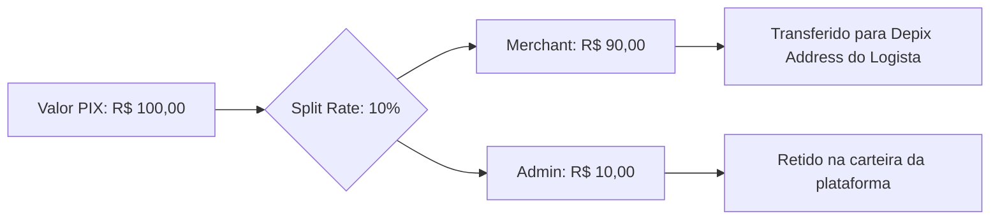

---

## 5. Fluxo de Configurações

### 5.1 Salvar Configurações

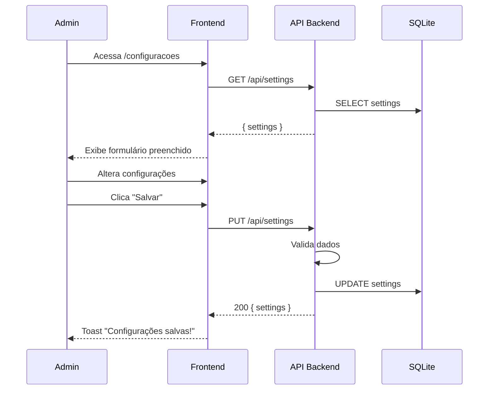

### 5.2 Testar Conexão Depix

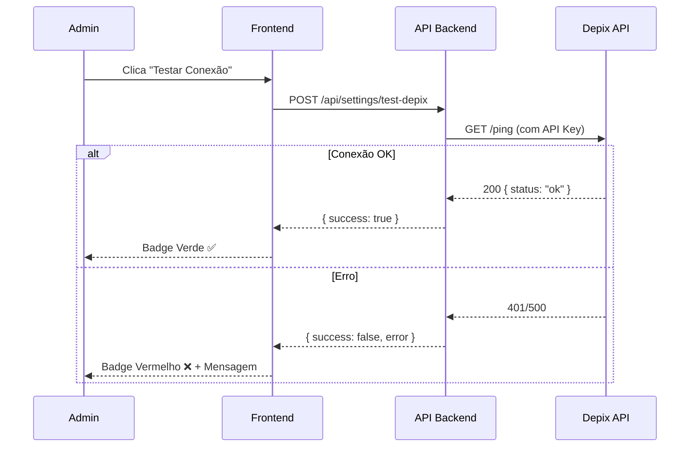

### 5.3 Autenticação Telegram

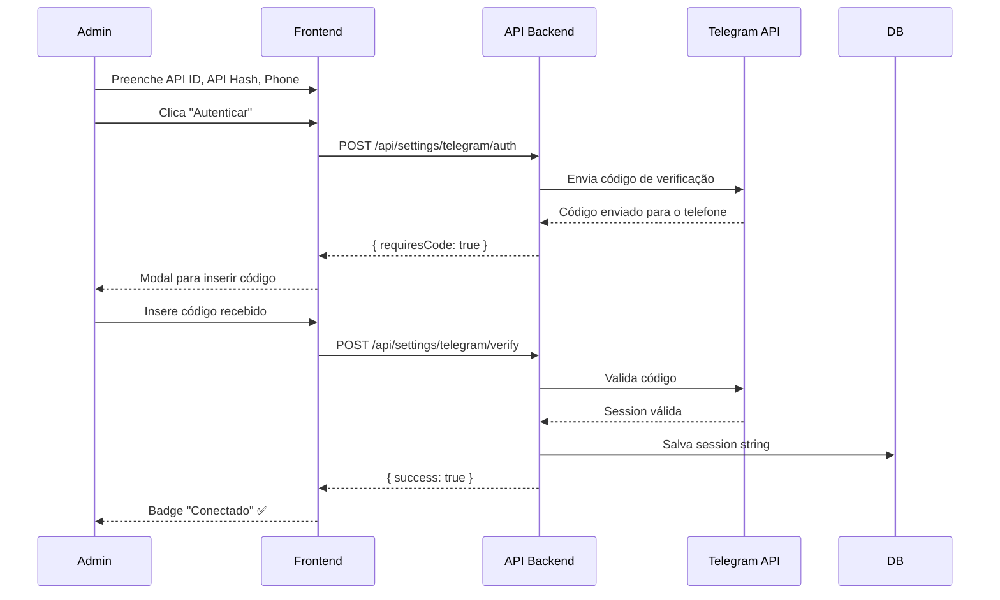

---

## 6. Fluxo de Dashboard

### 6.1 Carregamento Inicial

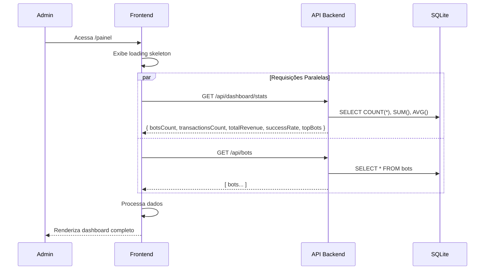

### 6.2 Dados Agregados (stats)

```sql
-- botsCount
SELECT COUNT(*) FROM bots WHERE status = 'active';

-- transactionsCount  
SELECT COUNT(*) FROM transactions;

-- totalRevenue
SELECT SUM(amountBrl) FROM transactions WHERE status = 'completed';

-- successRate
SELECT 
  (COUNT(*) FILTER (WHERE status = 'completed') * 100.0 / COUNT(*))
FROM transactions;

-- topBots
SELECT b.id, b.name, SUM(t.amountBrl) as revenue
FROM bots b
JOIN transactions t ON t.botId = b.id
WHERE t.status = 'completed'
GROUP BY b.id
ORDER BY revenue DESC
LIMIT 5;
```

---

## 7. Fluxo de Gerenciamento de Bots

### 7.1 Listar Bots com Filtros

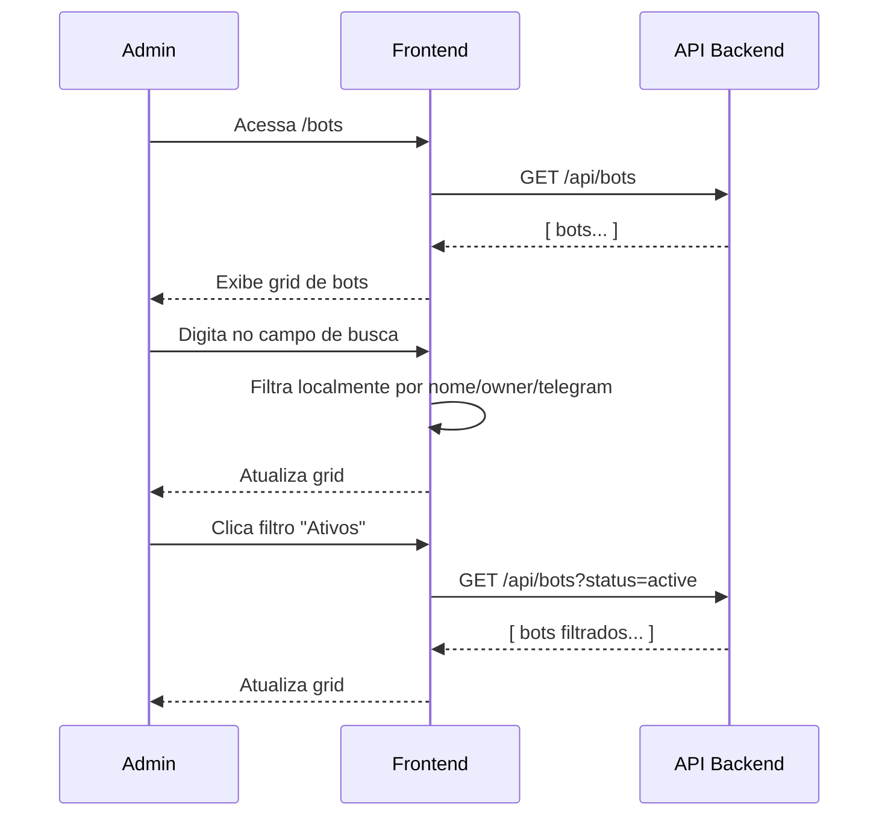

### 7.2 Editar Bot

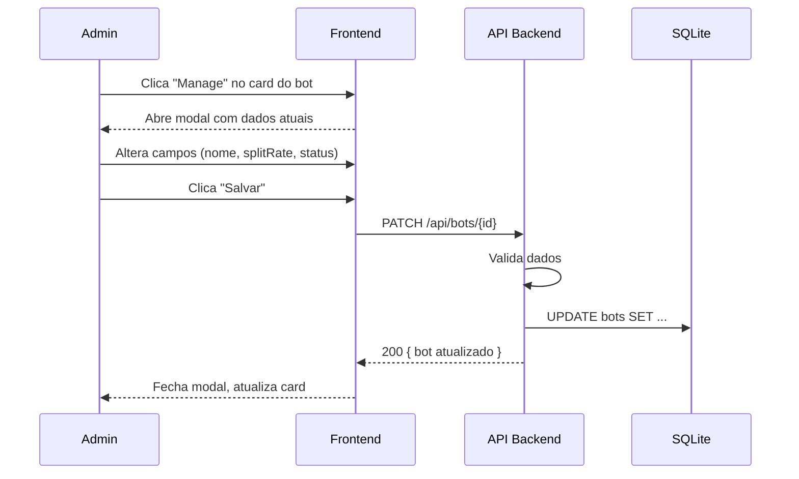

### 7.3 Desativar/Ativar Bot

```mermaid
flowchart TD
    A[Admin clica toggle status] --> B{Status atual?}
    B -->|Ativo| C[PATCH /api/bots/{id} status=inactive]
    B -->|Inativo| D[PATCH /api/bots/{id} status=active]
    C --> E[Para polling do bot Telegram]
    D --> F[Reinicia polling do bot Telegram]
    E --> G[Atualiza UI]
    F --> G
```

---

## Fluxos Auxiliares

### Interceptor de Erros (Frontend)

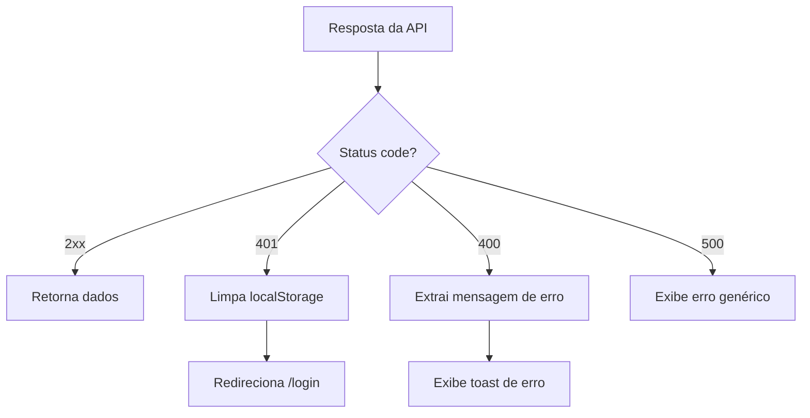

### Refresh de Dados

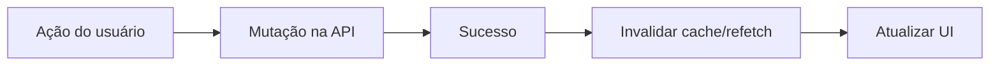

---

## Referência de Endpoints por Fluxo

| Fluxo | Endpoints Utilizados |
|-------|---------------------|
| Autenticação | `POST /auth/login` |
| Dashboard | `GET /dashboard/stats`, `GET /bots` |
| Criar Bot | `POST /bots` |
| Listar Bots | `GET /bots`, `GET /bots?status=` |
| Editar Bot | `PATCH /bots/{id}` |
| Deletar Bot | `DELETE /bots/{id}` |
| Transações | `GET /transactions`, `GET /transactions/{id}` |
| Exportar | `GET /transactions/export` |
| Configurações | `GET /settings`, `PUT /settings` |
| Testar Depix | `POST /settings/test-depix` |
| Auth Telegram | `POST /settings/telegram/auth` |
