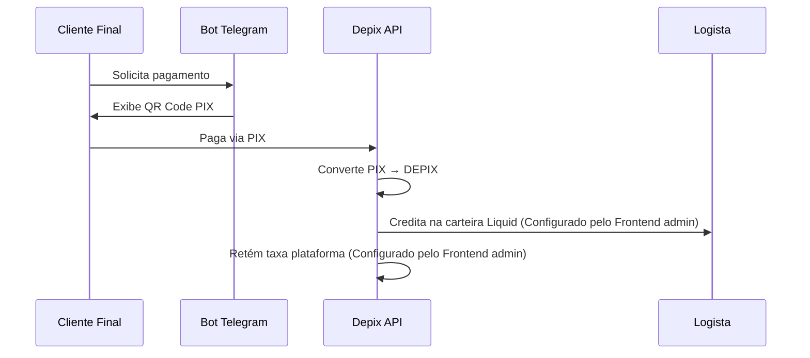

# 🤖 MultBot - PDV Multi Bot Telegram

Plataforma web para gestão de múltiplos bots Telegram de pagamento com integração **DEPIX** na rede Liquid.

## 📋 Sobre o Projeto

O MultBot permite criar e gerenciar bots de Telegram para logistas que utilizam DEPIX como forma de recebimento. Cada bot é independente e possui seu próprio endereço Liquid para recebimento de pagamentos.

### Fluxo de Pagamento



---

## 🛠️ Stack Tecnológica

### Frontend

| Tecnologia | Versão | Descrição |
|------------|--------|-----------|
| React | 18.3.1 | Framework UI |
| TypeScript | 5.5.3 | Linguagem |
| Vite | 5.4.21 | Build tool |
| Tailwind CSS | 3.4.17 | Styling |
| React Router | 6.30.3 | Roteamento |
| Framer Motion | 12.23.11 | Animações |
| Axios | 1.13.4 | HTTP Client |

### Backend

| Tecnologia | Versão | Descrição |
|------------|--------|-----------|
| Node.js | 20 LTS | Runtime |
| Fastify | 5.x | Framework HTTP de alta performance |
| TypeScript | 5.x | Linguagem com tipagem estática |
| Prisma | 6.x | ORM type-safe com migrations |
| SQLite | 3 | Banco de dados (arquivo único) |
| JWT | jsonwebtoken | Autenticação stateless |
| Zod | 3.x | Validação de schemas |
| bcryptjs | 3.x | Hash de senhas |
| node-telegram-bot-api | 0.66.0 | SDK para Telegram Bot API |
| @fastify/cors | 10.x | CORS middleware |
| @fastify/swagger | 9.x | Documentação OpenAPI |
| @scalar/fastify-api-reference | 1.x | UI da documentação API |
| tsx | 4.x | Dev server TypeScript |

#### Estrutura do Backend

```
packages/backend/
├── prisma/
│   ├── schema.prisma        # Models do banco
│   ├── migrations/          # Histórico de migrations
│   ├── seed.ts              # Seed de dados iniciais
│   └── dev.db               # SQLite file
├── src/
│   ├── index.ts             # Entry point
│   ├── app.ts               # Instância Fastify configurada
│   ├── config/
│   │   └── env.ts           # Variáveis de ambiente tipadas
│   ├── modules/
│   │   ├── auth/            # Autenticação JWT
│   │   ├── bots/            # CRUD de bots
│   │   ├── transactions/    # Gerenciamento transações
│   │   └── dashboard/       # KPIs e estatísticas
│   ├── telegram/
│   │   ├── bot.ts           # Factory de bots
│   │   ├── handlers/        # Command handlers
│   │   └── keyboards/       # Reply keyboards (preços)
│   └── lib/
│       ├── prisma.ts        # Prisma client singleton
│       └── jwt.ts           # Helpers JWT
├── package.json
├── tsconfig.json
└── .env
```

#### Schema Prisma

```prisma
model Admin {
  id        String   @id @default(cuid())
  email     String   @unique
  password  String   // bcrypt hash
  name      String
  createdAt DateTime @default(now())
  updatedAt DateTime @updatedAt
}

model Bot {
  id               String   @id @default(cuid())
  name             String
  telegramToken    String   @unique
  telegramUsername String?
  ownerName        String
  depixAddress     String   // Endereço Liquid
  splitRate        Float    @default(0.10)
  status           String   @default("active")
  createdAt        DateTime @default(now())
  updatedAt        DateTime @updatedAt
  transactions     Transaction[]
}

model Transaction {
  id            String    @id @default(cuid())
  botId         String
  amountBrl     Int       // Centavos
  depixAmount   Int       // Satoshis
  merchantSplit Int
  adminSplit    Int
  pixKey        String?
  customerName  String?
  status        String    @default("processing")
  createdAt     DateTime  @default(now())
  completedAt   DateTime?
  bot           Bot       @relation(fields: [botId], references: [id])
}
```

---

## 📁 Estrutura do Projeto

```
multbot/
├── Docs/                    # Documentação e specs
│   ├── Projeto.md           # Descrição do projeto
│   ├── Depix-OpenAPI-3.0.0.yaml
│   └── Pix2DePix API.apidog.json
├── packages/
│   ├── frontend/            # App React + Vite
│   │   ├── src/
│   │   │   ├── components/  # Layout, ProtectedRoute
│   │   │   ├── pages/       # Dashboard, Bots, Transações
│   │   │   └── lib/         # API client, utils
│   │   └── ...
│   └── backend/             # (Em desenvolvimento)
├── package.json             # Root workspace
└── pnpm-workspace.yaml
```

---

## 🚀 Início Rápido

### Pré-requisitos

- Node.js 20+
- pnpm 9+

### Instalação

```bash
# Clonar repositório
git clone <repo-url>
cd multbot

# Instalar dependências
pnpm install
```

### Desenvolvimento

```bash
# Iniciar frontend
pnpm dev
```

O frontend estará disponível em `http://localhost:5173`

---

## 📱 Páginas da Aplicação

| Rota | Descrição |
|------|-----------|
| `/login` | Autenticação do administrador |
| `/painel` | Dashboard com KPIs e estatísticas |
| `/bots` | Gerenciamento de bots Telegram |
| `/transacoes` | Histórico de transações |

---

## 🔐 Autenticação

O sistema utiliza JWT (JSON Web Token) armazenado no localStorage:

- **Login**: `POST /api/auth/login`
- **Token**: Enviado no header `Authorization: Bearer <token>`
- **Expiração**: 24 horas

### Credenciais de Teste

```
Email: admin@test.com
Senha: password123
```

---

## 🔌 API Endpoints

### Autenticação

| Método | Endpoint | Descrição |
|--------|----------|-----------|
| POST | `/api/auth/login` | Login com email/senha |

### Dashboard

| Método | Endpoint | Descrição |
|--------|----------|-----------|
| GET | `/api/dashboard/stats` | KPIs agregados |

### Bots

| Método | Endpoint | Descrição |
|--------|----------|-----------|
| GET | `/api/bots` | Listar bots |
| POST | `/api/bots` | Criar bot |
| GET | `/api/bots/:id` | Detalhes do bot |
| PATCH | `/api/bots/:id` | Atualizar bot |
| DELETE | `/api/bots/:id` | Remover bot |

### Transações

| Método | Endpoint | Descrição |
|--------|----------|-----------|
| GET | `/api/transactions` | Listar transações |
| GET | `/api/transactions/:id` | Detalhes da transação |

---

## 📊 Modelo de Dados

### Bot

```typescript
interface Bot {
  id: string;
  name: string;
  telegramToken: string;
  telegramUsername: string;
  ownerName: string;      // Logista
  depixAddress: string;   // Endereço Liquid
  splitRate: number;      // Taxa (padrão: 10%)
  status: 'active' | 'inactive';
}
```

### Transaction

```typescript
interface Transaction {
  id: string;
  botId: string;
  amountBrl: number;      // Centavos
  depixAmount: number;    // Satoshis
  merchantSplit: number;  // 90%
  adminSplit: number;     // 10%
  status: 'processing' | 'completed' | 'failed';
}
```

---

## 🤖 Bot Telegram - Fluxo do Logista

1. Logista acessa seu bot no Telegram
2. Usa ReplyKeyboardMarkup para definir valor (R$ 50, 150, 200, 300 ou customizado)
3. Bot gera QR Code PIX + Chave Copia/Cola
4. Cliente final paga o PIX
5. Depix processa e credita na carteira Liquid do logista

---

## ⚙️ Variáveis de Ambiente

### Frontend

```env
VITE_API_URL=http://localhost:3000/api
```

### Backend

```env
PORT=3000
JWT_SECRET=sua-chave-secreta
DEPIX_API_URL=https://api.depix.com
DEPIX_API_KEY=sua-api-key
```

---

## 📝 Scripts Disponíveis

```bash
pnpm dev        # Inicia todos os packages em dev
pnpm build      # Build de produção
pnpm test       # Executa testes
pnpm lint       # Linting
```

---

## 📄 Licença

MIT © 2026 MultBot
